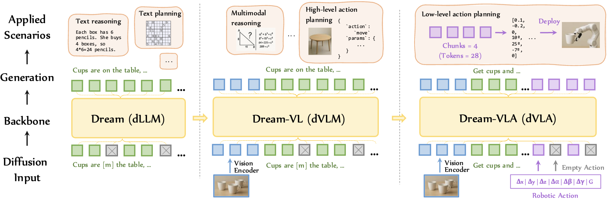

## Dream-VL & Dream-VLA

[](https://hkunlp.github.io/blog/2025/dream-vlx)
[](https://huggingface.co/Dream-org/Dream-VL-7B)
[](https://huggingface.co/Dream-org/Dream-VLA-7B)

**Dream-VL** and **Dream-VLA** are open **diffusion-based Vision-Language (VL)** and **Vision-Language-Action (VLA)** models built on top of the diffusion language model **Dream 7B**. They fully exploit discrete diffusion for **long-horizon planning**, **bidirectional reasoning**, and **parallel action generation** in multimodal tasks.

- **Dream-VL**: State-of-the-art among diffusion VLMs, competitive with top autoregressive VLMs trained on open data, and particularly strong on **visual planning** and long-horizon reasoning.
- **Dream-VLA**: A diffusion VLA model achieving **97.2%** avg on **LIBERO**, **71.4%** on **SimplerEnv–Bridge**, and **60.5%** on **SimplerEnv–Fractal**.


## 🚀 News

- **2025-12-23**: [Dream-VL](https://huggingface.co/Dream-org/Dream-VL-7B) & [Dream-VLA](https://huggingface.co/Dream-org/Dream-VLA-7B) models and [blog](https://hkunlp.github.io/blog/2025/dream-vlx) released.


## 🧱 Repository Structure

> The exact structure may evolve; please refer to the repo for up-to-date details.

```text
Dream-VLX/
├── Dream-VL/          # Dream-VL training and evaluation (preparing)
├── Dream-VLA/         # Dream-VLA training and evaluation (preparing)
└── README.md          # This file
```

## Citation
```
@article{ye2025dreamvla,
  title={Dream-VL & Dream-VLA: Open Vision-Language and Vision-Language-Action Models with Diffusion Language Model Backbone},
  author={Ye, Jiacheng and Gong, Shansan and Gao, Jiahui and Fan, Junming and Wu, Shuang and Bi, Wei and Bai, Haoli and Shang, Lifeng and Kong, Lingpeng},
  journal={arXiv preprint},
  year={2025}
}
```